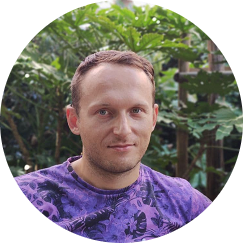

---


 &nbsp;&nbsp;&nbsp; [+380934387333](+380934387333)

 &nbsp;&nbsp;&nbsp;&nbsp; <chystyaks@gmail.com>

 &nbsp;&nbsp;&nbsp;&nbsp; <https://www.linkedin.com/in/sergiy-chystyak-005a2b1a3/>

 &nbsp;&nbsp;&nbsp;&nbsp; <https://t.me/chystyaks>

 &nbsp;&nbsp;&nbsp;&nbsp; <https://github.com/chystyaks>

---

My name is Sergiy and i am from Ukraine. 
I always liked tech field 
but never tried to make it my job... untill now.
My current life goal is to make a career in IT, 
specifically in front-end developing because i like the idea of using my skills in design and a logic of code.

  Skills:

    * HTML
    * CSS
    * JS
    * GIT
    
Languages:

    * English (B2 level)
    * Ukrainian
    * Russian
    * Italian

Example of my code:

```javascript
        function tickets(peopleInLine){
        let counter25=0,  counter50=0;
        for (let i =0; i<peopleInLine.length;i++)
        if (peopleInLine[i]===100&&(counter25>0&&(counter50>0||counter25>2)))
        counter50>0?(counter50--,counter25--):counter25-=3;
        } else if (peopleInLine[i]===50&&counter25>0) {
            counter50++;
            counter25--;
        } else if (peopleInLine[i]===25) {
            counter25++;
        } else return "NO";
        }
        return "YES";
        }
```
